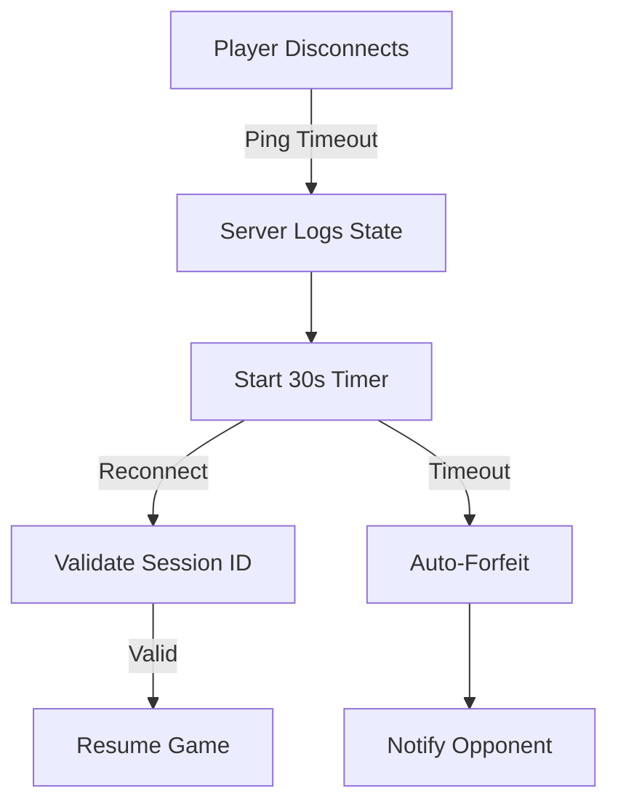

# ⚠️ Network Error Handling & Failure Recovery

### Iteration: P3
### Status: Comprehensive Proposal
### Purpose: Showcase real-world resilience & innovation in multiplayer system design

---

## 🎯 Scope

This document outlines how to detect, recover from, and prevent network-related issues in our multiplayer system, aligning with our architecture (`GameServerT`, `PlayerT`, `Networking`, `PlayerDatabase`, etc.).

> ⚠️ These proposals are intended for discussion. Final implementations require team consensus.

---

## 🔄 Disconnection Handling

### ✅ Detection

- `ServerSideConnection` detects dropped sockets via `IOException` or lack of ping.
- Ping mechanism: `PlayerT` sends periodic `ping()` messages; server monitors for timeouts.

### ✅ Pause & Notify

- Server pauses affected `Game` instance.
- Uses `sendSystemMessage()` to inform the other player of the disconnection.

### ✅ Reconnection Window

- 30-second grace period with reconnect timer per session.
- If player returns → resume game; if not → apply forfeit.

### ✅ Forfeit Handling

- Server ends game session and notifies remaining player.
- Cleanup handled in `Networking` or `GameServerT`.

---

## 🔁 Reconnection Workflow

- Client uses `reconnectRequest(sessionID)` with credentials.
- Server verifies and resumes `Game` if valid.
- If invalid or expired → inform client of forfeit and return to main menu.

---

## 📶 Move Transmission Failures

### 🔁 Retry Logic

- `PlayerT` retries sending move up to 3 times.
- Uses method like `Networking.retrySendMove()` (to be implemented).

### 🛑 Failure Protocol

- After 3 failed attempts, notify player: "Move failed – unstable connection".
- Optionally skip turn or auto-apply a default move.

---

## 🔐 Exploit Mitigation

### ✅ Move Validation

- `GameRules.isValidMove()` is used server-side to prevent:
   - Invalid format
   - Out-of-turn behavior
   - Replays

### 🔄 Replay Attack Defense

- Every move contains a `turnID` to avoid duplicates.
- Server rejects any mismatched or repeated move attempts.

### 🧼 Session Sanity

- One session per userID/IP.
- Cooldowns between reconnects.
- Server can reject clients abusing reconnect flow.

---

## ⚠️ Edge Case Handling Table

| Scenario | Strategy |
|----------|----------|
| Players send move at same time | Lock game object; queue second move |
| Move sent, then disconnect | Server finishes processing then logs disconnect |
| Disconnect → reconnect spam | Use session token with delay timer |
| Malformed move packet | Regex + bounds check; catch block |
| Multiple client moves per turn | Accept first; log and reject others |
| Server delay | Client timeout → offer manual re-sync |
| Server crash | Log board state to file every X turns |
| Silent disconnect | Ping every 5s, timeout after 15s |

---
## Move Retry Flow


``` flowchart TD
A[Client Sends Move] -->|Network Error| B{Retry Logic}
B -->|Retry 1| C[Attempt 1]
B -->|Retry 2| D[Attempt 2]
B -->|Retry 3| E[Attempt 3]

    C -->|Success| F[Server Receives]
    D -->|Success| F
    E -->|Success| F
    E -->|Fail| G[Notify Player] 
   
```


## 🧪 Recovery Flow (Visual)



## 🚀 Stretch Features
- Spectator Mode: Allow reconnecting players to rejoin as non-interactive observers.

- State Hashing: Validate sync between client/server via board hash check.

- Debug Mode: Step-by-step server replay for bug testing.

- Auto-moderation: Flag accounts that DC >3 times/day.

- Session Persistence: Save session to file for restore after crash.


## ✅ Summary
- Layer	Safeguard
- Server: 	Ping monitoring, game pausing, forfeit logic
- Client: 	Retry logic, reconnection attempt, timeout UI
- Game Logic: 	Turn-locking, move rejection
- Docs: 	Diagrams, protocol explanation, edge-case prep
- Chat & Matchmaking:	Extendable error handling planned in stubs
