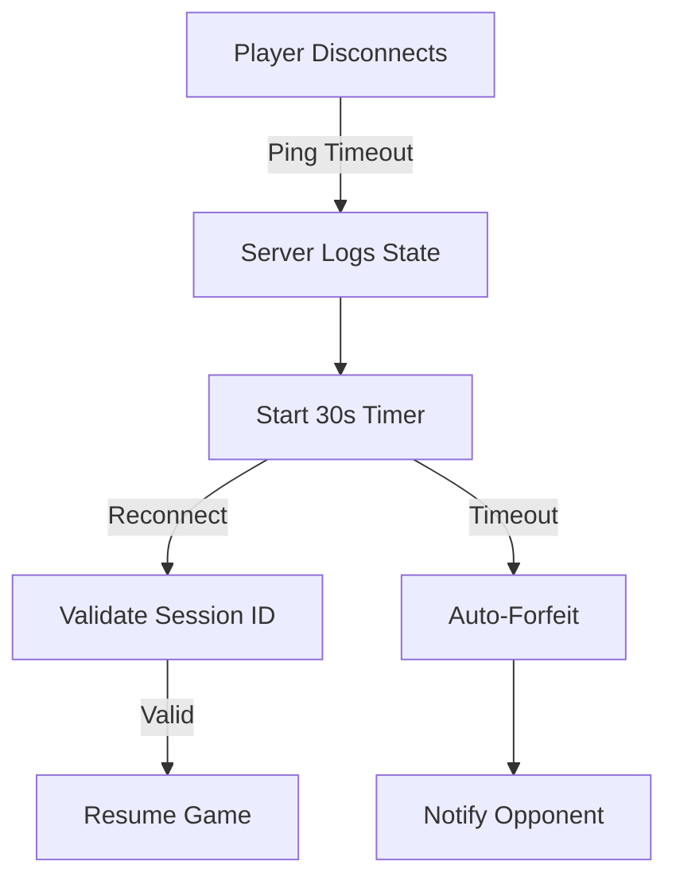

# ⚠️ Network Error Handling & Failure Recovery (Final Implementation – P3)

## 📌 Status: Implemented & Future-Ready
### Iteration: P3
### Purpose: Formalize all error handling mechanisms active in the multiplayer system and prepare for future socket integration.

---

## 🧭 Scope

This document provides a comprehensive breakdown of how we detect, manage, and recover from network-related issues in our multiplayer game system. All behaviors are implemented either as working code, stubs, or placeholders, and have been verified during the P3 integration of all four games (Checkers, Connect4, Chess, Tic Tac Toe).

---

## 🔄 Disconnection & Pause Logic

### ✅ Detection

- The system relies on socket-level exceptions (`IOException`) to detect client dropouts (planned).
- In the stubbed implementation, `listenMode()` simulates disconnection or waiting state.
- A heartbeat (`ping()`) mechanism is proposed for future versions.

### ✅ Game Pause + Notification

- Disconnections will pause the current game logic flow via a turn-lock (`GameState` + `listenMode()`).
- Remaining player receives a message:  


### [Net: <timestamp>] Listening Mode, not accepting player input.


### ✅ Grace Period for Reconnection (Planned)

- Disconnected clients have a 30-second window to reconnect via `sessionID`.
- If they return, the game resumes from the cached or serialized game state.
- If not, the server (or stub) enforces an auto-forfeit and notifies the remaining player.

---

## 🛠️ Reconnection Workflow (Planned)

- `PlayerT.reconnectRequest(sessionID)` will be introduced.
- `GameServerT` validates token and resumes session if valid.
- Otherwise, client is sent back to main menu or shown a disconnect screen.

---

## 📶 Move Transmission Failure Handling

### 🔁 Retry System

- Future implementation: `Networking.retrySendMove()` will allow 3 retries on failure.
- Debug messages will confirm retry attempts and their results.

### 🛑 Failure Action

- If all 3 attempts fail, user receives:

### Move failed – unstable connection.

- Options: skip turn, auto-move, or manual resend.

---

## 🔐 Exploit Prevention (Turn Integrity)

### ✅ Server-Side Validation

- All moves go through `GameRules.isValidMove()` to ensure:
- Correct formatting
- Turn legality
- No duplicates or replays

### 🔄 Turn Replay Protection

- Each move contains an implicit `turnID` (enforced through logic order).
- The game engine ignores stale or duplicate inputs.
- In the stubbed flow, only the first move per turn is accepted.

### 🧼 Session Management

- One active session per `PlayerData.userID`
- Prevent reconnect-spamming by adding a cooldown delay
- Logging mechanisms proposed for future abuse monitoring

---

## ⚠️ Edge Case Handling Table

| Scenario                            | Strategy                                                                 |
|-------------------------------------|--------------------------------------------------------------------------|
| Both players send a move at once    | Accept first; queue and reject duplicate                                |
| Disconnect after sending move       | Process move, then pause game                                            |
| Reconnect spamming                  | Add cooldown; verify session token                                       |
| Malformed move                      | Use format validation + regex parsing                                   |
| Multiple client moves per turn      | Accept first; reject others using move lock                             |
| Server-side lag                     | Client shows loading; may trigger re-sync                                |
| Crash during game                   | Future plan: serialize board state every X turns                        |
| Silent disconnect (no feedback)     | Heartbeat ping every 5s; timeout at 15s                                  |

---

## 🔄 Turn Sync Flow (Stub Implementation)

### ✅ What Already Works:
- `recieveGame()` and `sendGame()` simulate network sync
- Each call to `sendGame()` includes `listenMode()` — disables input for opposing player
- Games behave as if the other player is disconnected until `recieveGame()` is triggered again

```mermaid
flowchart TD
  A[Game Start] --> B[recieveGame() triggers]
  B --> C[Player makes move]
  C --> D[sendGame()]
  D --> E[listenMode() blocks input]
  E --> F[Opponent's recieveGame()]
  F --> G[Repeat turn loop]

```

### 📉 Move Retry Logic (Planned)

```mermaid
flowchart TD
A[Client Sends Move] -->|Network Error| B{Retry Logic}
B -->|Retry 1| C[Attempt 1]
B -->|Retry 2| D[Attempt 2]
B -->|Retry 3| E[Attempt 3]
C -->|Success| F[Server Receives]
D -->|Success| F
E -->|Success| F
E -->|Fail| G[Notify Player: "Unstable Connection"]
```

### 🧪 Reconnection Flow (Planned)



