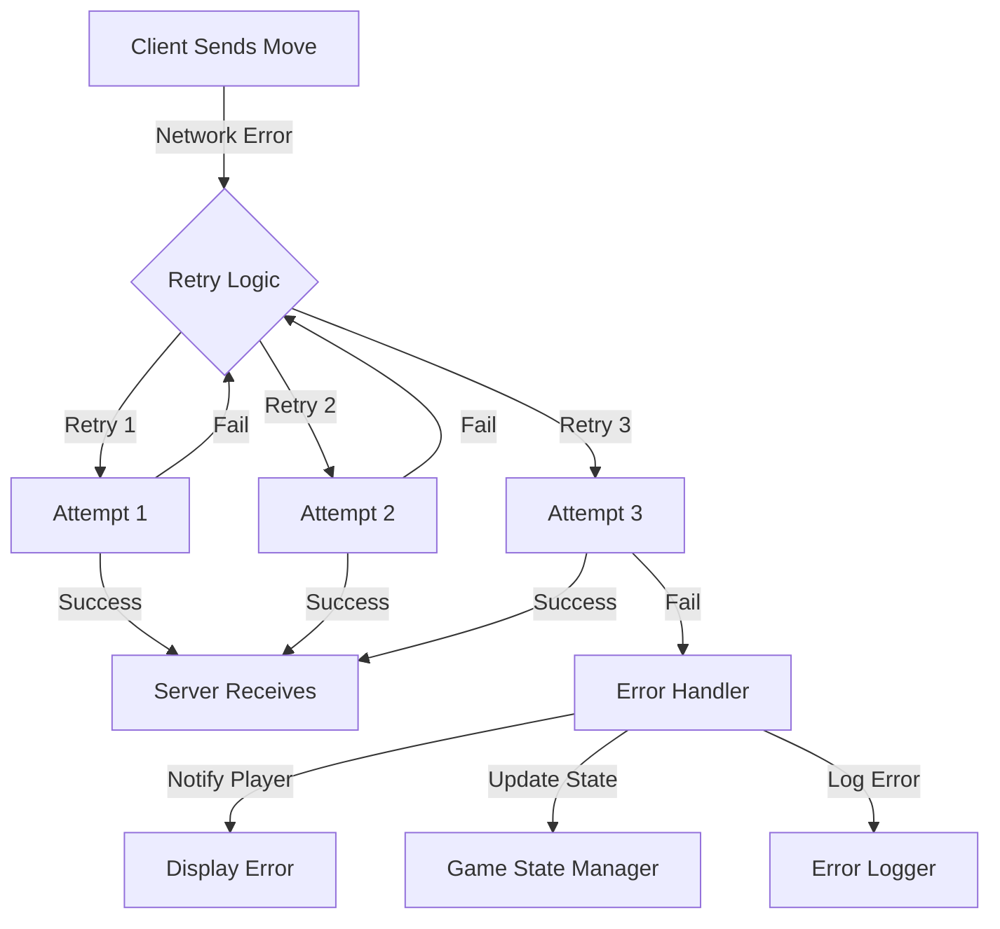
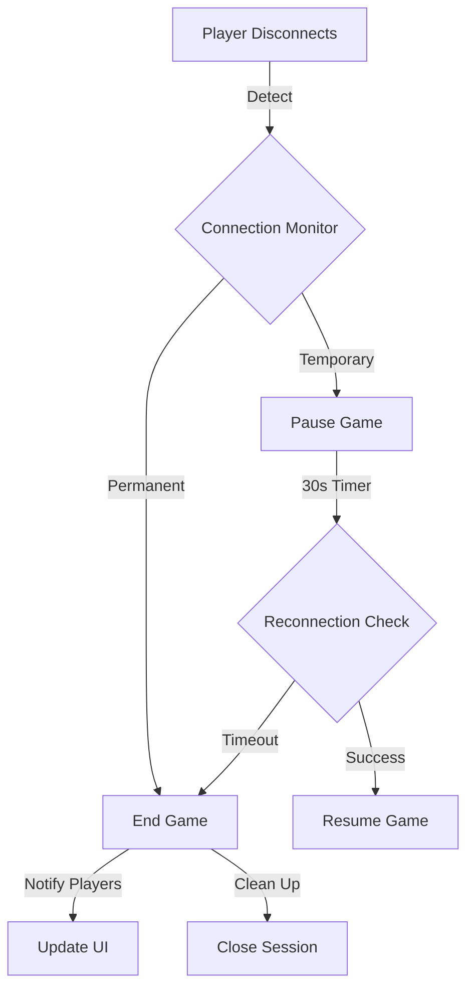

# Network Error Handling & Failure Recovery
## Note: The strategies outlined below are proposals intended for team discussion. No implementations will proceed without collective agreement.

## Overview
   ### This document proposes strategies for handling network errors, account disconnections, and failure recovery within our multiplayer system. The goal is to ensure a seamless gaming experience despite potential connectivity issues.

## Proposed Strategies for Handling Disconnections Mid-Game
   ### Detection of Disconnection:

#### Implement a mechanism where the server monitors active connections to promptly identify when a account disconnects.

### Temporary Game Pause:

#### Upon detecting a disconnection, the server pauses the game temporarily, notifying the remaining account of their opponent's disconnection.

### Reconnection Window:

#### Allow a 30-second window for the disconnected account to reconnect and resume the game from the paused state.

### Automatic Forfeit:

#### If the account fails to reconnect within the allotted time, the system automatically forfeits the game on their behalf, declaring the remaining account as the winner.
#### These strategies are proposed to maintain game integrity and provide a fair experience for all players.

## Proposed Reconnection Handling Process
   ### State Preservation:

#### Ensure the server preserves the game state during a account's disconnection to facilitate seamless resumption upon reconnection.

### State Restoration:

#### Upon reconnection within the allowed timeframe, the server restores the account's game state, allowing the match to continue from the point of interruption.

### Session Termination:

#### If the account does not reconnect within the specified period, the server terminates the session, and the remaining account is notified of their opponent's forfeiture.
#### These proposals aim to balance fairness and continuity in gameplay.

## Proposed Handling of Move Transmission Failures

### Automatic Retries:

#### Implement a system where, if a move fails to reach the server, the client automatically retries sending the move up to three times.

### Player Notification:

#### After multiple failed attempts, the system notifies the account of a potential network issue affecting their move transmission.

### Turn Skipping:

#### If the move cannot be transmitted after retries, the system may skip the account's turn or apply a default action, depending on the game's design.
#### These measures are suggested to ensure that temporary network issues do not unduly disrupt gameplay.

## Proposed Measures to Prevent Network Exploits

### Move Validation:

#### The server should validate all incoming moves to prevent unauthorized actions or cheating attempts.

### Replay Attack Prevention:

#### Implement checks to detect and prevent replay attacks, where a account might attempt to resend previous moves to manipulate the game state.

### Session Integrity:

#### Monitor for suspicious reconnection patterns, and if detected, the server can block or terminate the session to maintain game integrity.
#### These proposals are intended to safeguard the system against potential network-based exploits.

## Future Enhancements for Consideration
   
#### Spectator Mode:

#### Introduce a feature allowing disconnected players to rejoin the game as spectators, enabling them to watch the remainder of the match without participating.

### Extended Reconnection Grace Periods:

#### Consider implementing variable reconnection grace periods based on the game's state or importance, providing flexibility in handling disconnections.

### Peer-to-Peer Fallback:

### Explore the possibility of a peer-to-peer fallback mechanism to maintain game continuity in the event of server issues.

## These enhancements are suggestions for future discussion to further improve the system's resilience and account experience.

# Error Handling (Potential) Diagrams

