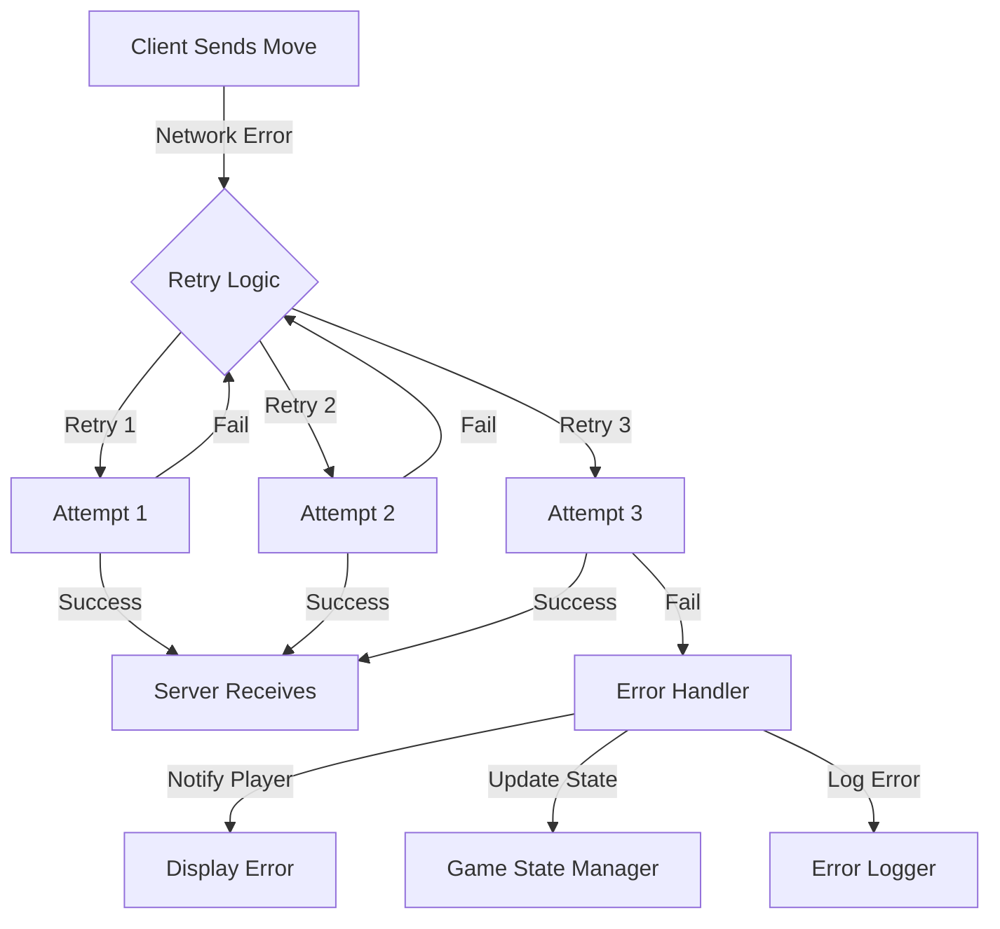
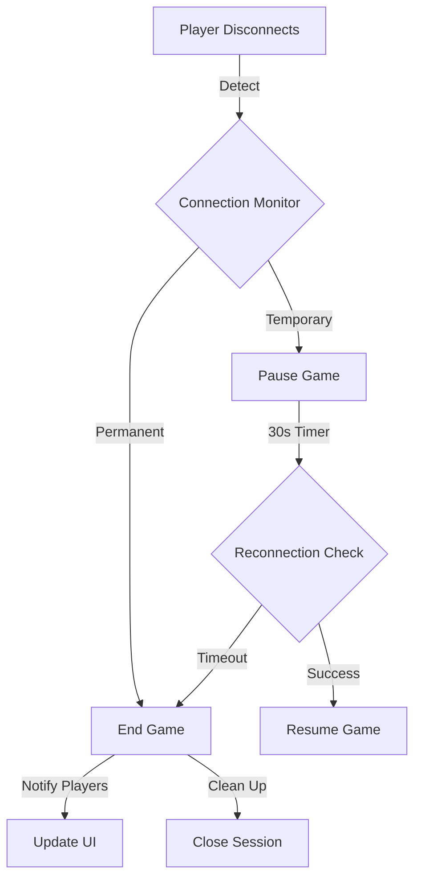

# Network Error Handling & Failure Recovery
# Iteration: P3
## Status: Comprehensive Proposal
## Purpose: Showcase real-world resilience & innovation in multiplayer system design

### What This Document Covers
#### This isn’t just about handling disconnects, This document proposes strategies for handling network errors, player disconnections, and failure recovery within our multiplayer system. The goal is to ensure a seamless gaming experience despite potential connectivity issues. It’s also about preparing for anything that could cause desyncs, exploits, delays, or confusion.

## Note: The strategies outlined below are proposals intended for team discussion. No implementations will proceed without collective agreement.

## Overview

## Proposed Strategies for Handling Disconnections Mid-Game
   ### Detection of Disconnection:

#### Implement a mechanism where the server monitors active connections to promptly identify when a player disconnects.

### Temporary Game Pause:

#### Upon detecting a disconnection, the server pauses the game temporarily, notifying the remaining player of their opponent's disconnection.

### Reconnection Window:

#### Allow a 30-second window for the disconnected player to reconnect and resume the game from the paused state.

### Automatic Forfeit:

#### If the player fails to reconnect within the allotted time, the system automatically forfeits the game on their behalf, declaring the remaining player as the winner.
#### These strategies are proposed to maintain game integrity and provide a fair experience for all players.

## Proposed Reconnection Handling Process
   ### State Preservation:

#### Ensure the server preserves the game state during a player's disconnection to facilitate seamless resumption upon reconnection.

### State Restoration:

#### Upon reconnection within the allowed timeframe, the server restores the player's game state, allowing the match to continue from the point of interruption.

### Session Termination:

#### If the player does not reconnect within the specified period, the server terminates the session, and the remaining player is notified of their opponent's forfeiture.
#### These proposals aim to balance fairness and continuity in gameplay.

## Proposed Handling of Move Transmission Failures

### Automatic Retries:

#### Implement a system where, if a move fails to reach the server, the client automatically retries sending the move up to three times.

### Player Notification:

#### After multiple failed attempts, the system notifies the player of a potential network issue affecting their move transmission.

### Turn Skipping:

#### If the move cannot be transmitted after retries, the system may skip the player's turn or apply a default action, depending on the game's design.
#### These measures are suggested to ensure that temporary network issues do not unduly disrupt gameplay.

## Proposed Measures to Prevent Network Exploits

### Move Validation:

#### The server should validate all incoming moves to prevent unauthorized actions or cheating attempts.

### Replay Attack Prevention:

#### Implement checks to detect and prevent replay attacks, where a player might attempt to resend previous moves to manipulate the game state.

### Session Integrity:

#### Monitor for suspicious reconnection patterns, and if detected, the server can block or terminate the session to maintain game integrity.
#### These proposals are intended to safeguard the system against potential network-based exploits.

## Future Enhancements for Consideration:
#### Network flakiness, Player-triggered manipulation, Server limitations or failure, Simultaneous actions, Edge-case timing windows

### Anticipating Edge Cases
#### 🔸 Players act simultaneously (same button, same millisecond)
- Server must lock state per turn so that the first message wins

- Add turnID or moveToken to each move to avoid race conditions

- Reject or queue second move if same target received simultaneously

🟢 Proposed: Implement turn lock or semaphore on move process

#### 🔸 One player disconnects right after sending a move
- Server should finish processing move and then trigger disconnect flow

- Prevents state corruption from unprocessed input

#### 🔸 Player disconnects and reconnects repeatedly
- Add session ID or timestamp to prevent "looping restarts"

- Reject repeated joins within X seconds

- Possible reconnect cooldown timer

#### 🔸 Malicious packet injection / malformed move
- Validate that move is well-formed before parsing (regex, bounds checks)

- Include server-side try/catch and logging for security auditing

### Networking Failures
#### 🔸 Server doesn’t receive move due to packet loss
- Client should retry up to 3x

- After failure, display visual feedback: “Move failed – connection unstable”

#### 🔸 Server receives two moves from same player
- Enforce one move per turn

- Ignore second message (or log and flag)

##### 🔸 Player never receives server update
- Client should timeout after 5s waiting for board update

- If missed, allow player to manually request a state re-sync

### Server Fault Handling
#### 🔸 Server crashes mid-game
- Log active session state to file every X seconds

- Restart with same state (if desired)

- Display message to both clients on resume: “Previous session resumed from safe state”

🟡 Stretch goal: File-based session persistence or database checkpointing

#### 🔸 Server loses one client connection silently (no crash)
- Add heartbeat check (ping() every 5s)

- If no pong received in 15s → trigger disconnect logic

### Reconnection + Recovery
#### ✅ Recovery Sequence
- Player disconnects

- Server logs game state, starts timer

- Player reconnects within time

- Server verifies session ID + last known state

- Game resumes from previous turn

#### 🔄 If not recovered:
- Server sends forfeit message to opponent

- Cleans up session memory

- Logs error to analytics

### Exploit Mitigation
#### 🧤 Force-forfeit spam
- Add cooldown on quit → rejoin

- One session per client at a time (lock by IP/userID)

- 🕵️ Replay move exploit
- Moves must be: Unique, Sequential, Bound to server-validated turn , Any duplicate gets rejected

### More Potential Future Enhancements
#### Auto-moderation: flag accounts that fail 3+ sessions in one day

#### Session observers: spectators or debuggers

#### Sync Debug Mode: manually step through session state during test builds

#### Real-time sync hashes: server and clients compare board hash each turn to verify consistency

#### Spectator Mode:

#### Introduce a feature allowing disconnected players to rejoin the game as spectators, enabling them to watch the remainder of the match without participating.

### Extended Reconnection Grace Periods:

#### Consider implementing variable reconnection grace periods based on the game's state or importance, providing flexibility in handling disconnections.

### Peer-to-Peer Fallback:

### Explore the possibility of a peer-to-peer fallback mechanism to maintain game continuity in the event of server issues.

## These enhancements are suggestions for future discussion to further improve the system's resilience and player experience.

# Error Handling (Potential) Diagrams

### 🧪 Suggested Diagrams (For Later)
1. Conflict Handling:
   Player A and B both click → Server resolves → Responds to both

2. Reconnection Timing:
   Disconnect → Reconnect → State match → Resume
   Disconnect → Timeout → Forfeit

3. Timeout Flow:
   Client sends → Server doesn’t respond → Retry → Manual refresh or forfeit
   